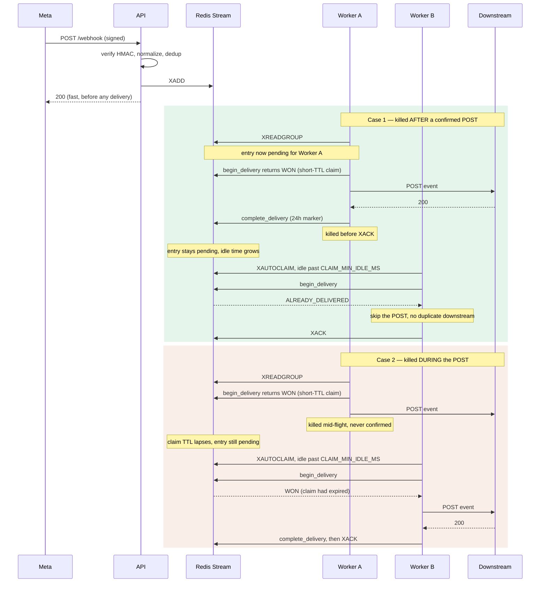

# WhatsApp Webhook Normalizer

A hardened ingestion service for the WhatsApp Cloud API: it verifies Meta's signature, flattens every message and status shape into one schema, drops redeliveries, and forwards events to your backend with at-least-once delivery.

[](https://github.com/harinazrekar/whatsapp-normalizer/actions/workflows/ci.yml)
[](LICENSE)
[](https://www.python.org/downloads/)
[](https://github.com/psf/black)
[](https://mypy-lang.org/)

---

## Why this exists

The WhatsApp Cloud API webhook is deceptively hostile. Four things about it break naive integrations, and all four bite in production rather than in testing.

**The payload shape is not one shape.** Everything arrives wrapped in `entry[] → changes[] → value`, and then diverges. A text message puts its content at `messages[0].text.body`. A quick-reply button puts it at `messages[0].button.text`. An interactive button reply puts it at `messages[0].interactive.button_reply.title`, and a list reply at `messages[0].interactive.list_reply.title`. Media captions live under a key named after the media type. Delivery receipts don't come as `messages` at all — they come as `statuses`, with a different id field and a different notion of who "from" is. Every consumer that talks to the raw webhook re-implements the same nest of `.get()` chains, and each one gets a different subset of the cases right.

**Meta redelivers.** The same `message_id` will arrive more than once — after a timeout, after a transient error on your side, sometimes for no visible reason. Without deduplication, redelivery means a duplicate order, a duplicate charge, a duplicate reply to the customer.

**Meta punishes slowness.** The webhook must return 2xx quickly. A slow handler or a non-2xx response is treated as a failed delivery: Meta retries, and if failures persist it backs off and can eventually disable the subscription. Doing real work inline — calling an LLM, writing to a slow database, waking a downstream service — is how integrations quietly stop receiving messages.

**The payload is unsigned unless you check it.** The webhook URL is not a secret; it appears in the App Dashboard, in DNS, in certificate transparency logs. Meta signs each delivery with `X-Hub-Signature-256`, but nothing forces you to verify it. Skip that check and anyone who finds the URL can inject arbitrary "customer messages" into your pipeline.

This service is the boring layer that handles all four, so the code you actually care about receives one predictable JSON shape, exactly once, from a queue.

---

## Architecture

```mermaid
flowchart LR
    Meta["Meta Cloud API"]

    subgraph Edge["Edge"]
        Caddy["Caddy<br/>TLS via Let's Encrypt"]
    end

    subgraph API["FastAPI ingest"]
        Verify["Verify HMAC<br/>over raw bytes"]
        Norm["Normalize<br/>entry / changes / value"]
        Dedup["Dedup<br/>SET NX on message_id"]
    end

    Stream[("Redis Stream<br/>wa:events:stream")]

    subgraph Worker["Delivery worker"]
        Read["XREADGROUP<br/>consumer group"]
        Claim["begin_delivery()<br/>SET NX, short TTL"]
        Post["POST downstream"]
        Retry["Exponential backoff<br/>re-publish"]
    end

    Down["DOWNSTREAM_WEBHOOK_URL"]
    DLQ[("DLQ<br/>wa:events:dlq")]

    Meta -->|"HTTPS POST /webhook"| Caddy
    Caddy --> Verify
    Verify -->|"403 if bad or missing"| Reject["Rejected"]
    Verify --> Norm
    Norm --> Dedup
    Dedup -->|"already seen"| Drop["Dropped, counted"]
    Dedup -->|"Redis unavailable, 503"| Redeliver["Meta redelivers"]
    Dedup -->|"new"| Stream

    Stream --> Read
    Read --> Claim
    Claim -->|"ALREADY_DELIVERED"| Ack["XACK, no resend"]
    Claim -->|"IN_PROGRESS"| Defer["Leave pending<br/>for the holder"]
    Claim -->|"WON"| Post
    Post -->|"2xx"| Down
    Post -->|"failure"| Retry
    Retry -->|"retry_count within MAX_RETRIES"| Stream
    Retry -->|"retries exhausted"| DLQ

    Stream -.->|"XAUTOCLAIM after CLAIM_MIN_IDLE_MS"| Read
```



The dotted edge is the reclaim path: entries a worker claimed but never acknowledged — because it was killed mid-delivery — are adopted by a live worker once they have been idle past `CLAIM_MIN_IDLE_MS`.

### Why Redis Streams and not a list

The original implementation used `RPUSH`/`BLPOP`. That is at-most-once delivery: `BLPOP` removes the entry from Redis before the worker has done anything with it, so a crash between the pop and the downstream POST loses the event with nothing to replay from and no trace it ever existed.

A stream with a consumer group is at-least-once instead. `XREADGROUP` moves an entry into the consumer's pending list rather than deleting it; it is only forgotten on an explicit `XACK`. A worker that dies leaves its entries pending, and `XAUTOCLAIM` lets a live worker adopt them.

At-least-once means duplicates are possible **by design**, which is why idempotency is enforced on both sides: dedup on `message_id` at ingest (absorbs Meta's redeliveries) and a separate delivery claim in the worker (absorbs reclaims and retries).

### Why the delivery claim has two states, not one

The worker's claim on `wa:delivered:<message_id>` is not a single boolean. `begin_delivery()` returns one of three answers:

| Result | Meaning | What the worker does |
| --- | --- | --- |
| `WON` | Nobody holds this event. | POST it downstream. |
| `ALREADY_DELIVERED` | A previous attempt **confirmed** the downstream received it. | `XACK` without re-sending. |
| `IN_PROGRESS` | Another worker holds a live claim right now. | Nothing — leave the entry pending for the holder. |

The distinction between the last two is the whole point, and conflating them is a bug this service has already had. A worker that dies **after** a confirmed POST must not have its event re-sent; a worker that dies **mid-POST** must have its event retried, because nothing ever confirmed the downstream saw it. A single marker cannot tell those apart, so the reclaiming worker acked an unconfirmed event and it was silently dropped.

The two are separated by TTL. The in-flight claim written by `begin_delivery()` is short-lived — derived from `DOWNSTREAM_TIMEOUT_SECONDS + RETRY_BACKOFF_MAX_SECONDS`, long enough to outlast one full attempt including its backoff sleep, and no longer. When a worker dies mid-attempt the claim simply lapses, and the reclaiming worker wins a fresh one and retries. `complete_delivery()` then overwrites that claim with a long-lived (`DELIVERED_TTL_SECONDS`, 24h) *completed* marker, and only that marker retires an entry without a resend. `abandon_delivery()` drops a claim after a failed POST so the next attempt may proceed.



The order inside `handle()` is the load-bearing detail: the claim is taken **before** the POST and upgraded to the completed marker **before** the `XACK`, and it is held for the whole attempt including the backoff sleep. Releasing it early would let a reclaiming worker start a parallel attempt on an entry this one still holds, doubling the copies in flight on every retry round.

Because the claim must outlast one full attempt, `CLAIM_MIN_IDLE_MS` must exceed `DOWNSTREAM_TIMEOUT_SECONDS + RETRY_BACKOFF_MAX_SECONDS` — `Settings.validate()` enforces this at startup rather than leaving it as a comment nobody reads.

---

## Features

Everything listed here exists in the code and is covered by the test suite.

### Security

| Feature | Detail |
| --- | --- |
| `X-Hub-Signature-256` verification | HMAC-SHA256 over the raw request body, keyed with the Meta App Secret. `403` before any parsing or queueing. |
| Raw-body discipline | The body is read as bytes before `json.loads`. Re-serialized JSON changes whitespace and key order and would never match the digest. |
| Constant-time comparison | Both the signature and the verify token use `hmac.compare_digest`, on **bytes**. Comparing `str` raises `TypeError` on non-ASCII input, and header values are latin-1 decoded — so an anonymous caller could turn any request into an unhandled `500` before authentication. A plain `==` short-circuits on the first differing byte and leaks the correct prefix to anyone timing responses. |
| Fail-fast config validation | `Settings.validate()` runs in the API lifespan and the worker entrypoint. Missing or placeholder secrets abort startup, as does a `CLAIM_MIN_IDLE_MS` too short to cover one full delivery attempt. |
| Per-IP rate limiting | `slowapi` on `POST /webhook`, default `120/minute`. Meta's own rate is far below this; the limit blunts replay storms and stray traffic. Behind a reverse proxy this needs `FORWARDED_ALLOW_IPS` set — see the configuration table. |
| Replay resistance | Every `message_id` is claimed atomically with `SET NX EX` for `DEDUP_TTL_SECONDS` (24h default). |
| Non-root container | Fixed uid/gid 10001; application code is owned by root and merely readable, so a compromised process cannot rewrite its own code. |
| Network segmentation (prod) | Redis publishes no host port and sits on an `internal: true` network Caddy cannot reach. |

See [`SECURITY.md`](SECURITY.md) for the full threat model and what is explicitly out of scope.

### Reliability

| Feature | Detail |
| --- | --- |
| At-least-once delivery | Redis Streams consumer group: `XADD` → `XREADGROUP` → `XACK`. Nothing is forgotten until it reaches a terminal state. |
| Crash recovery | `XAUTOCLAIM` adopts entries left pending by a dead consumer after `CLAIM_MIN_IDLE_MS`. |
| Idempotent delivery | `begin_delivery()` takes a short-TTL `SET NX` claim on `wa:delivered:<message_id>` before the POST; `complete_delivery()` upgrades it to a 24h marker only once the downstream confirmed. A reclaim after a *confirmed* delivery skips the resend; a reclaim after a crash *mid*-POST retries it. |
| Exponential backoff | `RETRY_BACKOFF_BASE ** retry_count`, capped at `RETRY_BACKOFF_MAX_SECONDS`, up to `MAX_RETRIES` attempts. The claim is held across the backoff sleep, so a reclaimer cannot start a parallel attempt and double the copies in flight each round. |
| Dead-letter queue | Exhausted events are parked in a separate stream for inspection or replay, never dropped. Capped at `DLQ_MAXLEN`. |
| Graceful shutdown | SIGTERM/SIGINT set a shutdown event; the in-flight batch finishes and acks. `stop_grace_period: 30s` in both compose files. |
| Concurrent batches | A batch is handled with `asyncio.gather`, so one event sleeping out its backoff does not stall the ones behind it. Exceptions are inspected, not swallowed. |
| No accidental 5xx back to Meta | Unknown payload shapes are skipped rather than raised; malformed JSON is a `400`; non-ASCII header bytes no longer crash the comparison. The one *deliberate* 5xx is a `503` when Redis cannot accept the write — Meta redelivers, whereas a `200` would lose the event. |
| Bounded streams | `XADD` trims with `MAXLEN ~ STREAM_MAXLEN`, the DLQ with `MAXLEN ~ DLQ_MAXLEN`, and `XACK` is paired with `XDEL` so acked history does not accumulate. Under `noeviction`, an uncapped DLQ would eventually make ingest writes fail. |
| Durable Redis | `appendonly yes` with `appendfsync everysec` on a named volume; production adds `maxmemory-policy noeviction` so writes fail loudly rather than silently evicting undelivered events. |

### Observability

| Feature | Detail |
| --- | --- |
| Structured JSON logs | Stdlib logging with a JSON formatter. uvicorn's handlers are cleared so its records come out in the same shape, not as a second log stream. |
| Correlation IDs | Assigned at ingest (or honoured from an inbound `X-Correlation-Id`), stored in a `ContextVar`, carried through the queue, echoed on the response, and sent as `X-Correlation-Id` on the downstream POST. |
| Event context on every line | `message_id`, `event_type`, `retry_count` attached via `extra=`. |
| Prometheus metrics | `/metrics` with ingest counters, delivery counters, a delivery-duration histogram, and queue-state gauges sampled from Redis at scrape time. |
| Real health check | `/health` pings Redis and returns `503` when it is unreachable, so a load balancer can actually take the instance out of rotation. |
| Human-readable dev logs | `LOG_FORMAT=console` swaps JSON for a readable line format. |

---

## The normalized event

Two raw payloads for what a user would describe as "they sent me something":

<details>
<summary><strong>Raw: text message</strong></summary>

```json
{
  "object": "whatsapp_business_account",
  "entry": [{
    "id": "102290129340398",
    "changes": [{
      "field": "messages",
      "value": {
        "messaging_product": "whatsapp",
        "metadata": { "display_phone_number": "15550001111", "phone_number_id": "1234" },
        "contacts": [{ "profile": { "name": "Ada" }, "wa_id": "919876543210" }],
        "messages": [{
          "from": "919876543210",
          "id": "wamid.HBgMOTE5ODc2NTQzMjEwFQIAEhgU",
          "timestamp": "1754640000",
          "type": "text",
          "text": { "body": "Do you deliver on Sundays?" }
        }]
      }
    }]
  }]
}
```

</details>

<details>
<summary><strong>Raw: interactive button reply</strong></summary>

```json
{
  "object": "whatsapp_business_account",
  "entry": [{
    "id": "102290129340398",
    "changes": [{
      "field": "messages",
      "value": {
        "messaging_product": "whatsapp",
        "metadata": { "display_phone_number": "15550001111", "phone_number_id": "1234" },
        "messages": [{
          "from": "919876543210",
          "id": "wamid.HBgMOTE5ODc2NTQzMjEwFQIAEhgV",
          "timestamp": "1754640060",
          "type": "interactive",
          "interactive": {
            "type": "button_reply",
            "button_reply": { "id": "sunday_yes", "title": "Yes, Sundays too" }
          }
        }]
      }
    }]
  }]
}
```

</details>

The text is at `text.body` in one and `interactive.button_reply.title` in the other. A delivery receipt for the same conversation arrives under `statuses` with no `type` field at all and its identifier in a different place. Both become the same thing here.

### Schema

| Field | Type | Description |
| --- | --- | --- |
| `message_id` | `str` | WhatsApp `wamid`. The dedup key. For a status event this is the id of the message the status refers to. |
| `event_type` | `"message" \| "status"` | Which half of the webhook this came from. |
| `message_type` | `str \| null` | `text`, `image`, `button`, `interactive`, `location`, … Populated for messages only. |
| `text` | `str \| null` | Best-effort human-readable text: the body, the button/list title, the media caption, or `"lat,lng"` for a location. `null` when the type carries no text. |
| `status` | `str \| null` | `sent`, `delivered`, `read`, `failed`. Populated for status events only. |
| `from_number` | `str \| null` | Sender for messages; `recipient_id` for statuses. |
| `to_number` | `str \| null` | Your `display_phone_number` from the payload metadata. |
| `timestamp` | `int \| null` | Unix seconds, coerced from Meta's string. `null` if absent or uncoercible. |
| `raw` | `dict` | The original payload fragment, kept verbatim for anything this schema doesn't model. |
| `received_at` | `float` | Unix seconds at ingest. |
| `retry_count` | `int` | Delivery attempts so far. `0` on the first pass. |
| `correlation_id` | `str` | Assigned at ingest, carried through the queue, sent downstream as `X-Correlation-Id`. |

Both of the payloads above normalize to this, differing only in `message_type`, `text`, and `raw`:

```json
{
  "message_id": "wamid.HBgMOTE5ODc2NTQzMjEwFQIAEhgV",
  "event_type": "message",
  "message_type": "interactive",
  "text": "Yes, Sundays too",
  "status": null,
  "from_number": "919876543210",
  "to_number": "15550001111",
  "timestamp": 1754640060,
  "raw": {
    "from": "919876543210",
    "id": "wamid.HBgMOTE5ODc2NTQzMjEwFQIAEhgV",
    "timestamp": "1754640060",
    "type": "interactive",
    "interactive": {
      "type": "button_reply",
      "button_reply": { "id": "sunday_yes", "title": "Yes, Sundays too" }
    }
  },
  "received_at": 1754640060.812,
  "retry_count": 0,
  "correlation_id": "9f2c41ab7e0d5b83"
}
```

`raw` is deliberately preserved. The flat fields cover the common path; when you need the interactive button's `id` rather than its title, or the contact profile name, it is still there and you don't have to change this service to get at it.

---

## Quickstart

Requires Docker and Docker Compose. Python 3.11+ only if you want to run the tests or the API outside a container.

```bash
git clone https://github.com/harinazrekar/whatsapp-normalizer.git
cd whatsapp-normalizer
cp .env.example .env
```

Generate a verify token and put it in `.env`:

```bash
python3 -c "import secrets; print(secrets.token_urlsafe(32))"
```

Set `WHATSAPP_VERIFY_TOKEN` to that value. Set `WHATSAPP_APP_SECRET` from the Meta App Dashboard (see the walkthrough below) — or, if you don't have it yet, set `REQUIRE_SIGNATURE=false` for now. The service **will refuse to start** with the placeholder values still in place; that is intentional.

```bash
make up          # docker compose up -d --build
make ps          # api and redis should both read "healthy"
```

Verify:

```bash
curl -s localhost:8000/health
# {"status":"ok","redis":"ok"}

curl -s localhost:8000/stats
# {"queued":0,"in_flight":0,"dead_lettered":0,"dedup_hit_rate":0.0}
```

Send yourself a signed request without involving Meta at all:

```bash
SECRET="$(grep '^WHATSAPP_APP_SECRET=' .env | cut -d= -f2-)"
BODY='{"entry":[{"changes":[{"value":{"metadata":{"display_phone_number":"15550001111"},"messages":[{"from":"919876543210","id":"wamid.TEST1","timestamp":"1754640000","type":"text","text":{"body":"hello"}}]}}]}]}'
SIG="sha256=$(printf '%s' "$BODY" | openssl dgst -sha256 -hmac "$SECRET" | awk '{print $2}')"

curl -s -X POST localhost:8000/webhook \
  -H "Content-Type: application/json" \
  -H "X-Hub-Signature-256: $SIG" \
  -d "$BODY"
# {"received":1,"queued":1,"duplicates":0}
```

Repeat the same command and you'll get `{"received":1,"queued":0,"duplicates":1}` — that's the dedup working.

For local development without Docker:

```bash
python3.11 -m venv .venv && source .venv/bin/activate
make install
make dev         # API on 127.0.0.1:8000, auto-reload
make worker      # in a second terminal
```

Run `make` for the full task list.

---

## Connecting a Meta developer app

This is the part that actually costs people an afternoon. Follow it in order; the ordering matters more than it looks.

### 1. Create a Meta app

Go to [developers.facebook.com/apps](https://developers.facebook.com/apps) and click **Create App**. When asked what you're building, choose **Other**, then app type **Business**. Give it a name and, if prompted, attach a Business portfolio (creating a new one is fine).

<!-- screenshot -->

### 2. Add the WhatsApp product

On the new app's dashboard, find **WhatsApp** in the product list and click **Set up**. This creates a test WhatsApp Business Account for you automatically.

<!-- screenshot -->

### 3. Note the test number and temporary token

Go to **WhatsApp → API Setup**. You get:

- a **test phone number** ("From") with a `Phone number ID`,
- a **temporary access token**, valid 24 hours,
- a **To** field where you add up to five recipient numbers for testing.

Add your own WhatsApp number under **To** and complete the confirmation code it sends you. Until you do, Meta will not deliver messages between you and the test number.

<!-- screenshot -->

You do **not** need the access token for this service — it only receives, it never sends. It's worth grabbing anyway if you want to test outbound messages later.

### 4. Copy the App Secret

**App settings → Basic → App Secret → Show**. Copy it into `.env` as `WHATSAPP_APP_SECRET`.

<!-- screenshot -->

This is the value the entire security model rests on. It is not the access token, and it is not the Phone number ID — mixing those up is the single most common cause of every delivery returning 403.

### 5. Expose your local service over HTTPS

Meta will not accept an `http://` callback URL, and will not accept an HTTPS URL whose certificate doesn't validate. Locally, that means a tunnel:

```bash
ngrok http 8000
```

```
Forwarding    https://a1b2-93-184-216-34.ngrok-free.app -> http://localhost:8000
```

Confirm the tunnel actually reaches the app before touching the dashboard:

```bash
curl -s https://a1b2-93-184-216-34.ngrok-free.app/health
```

On ngrok's free plan this hostname changes every restart, and each change means redoing step 6.

### 6. Configure the webhook

Go to **WhatsApp → Configuration**. Under **Webhook**, click **Edit**.

- **Callback URL**: your HTTPS URL **plus the `/webhook` path** —
  `https://a1b2-93-184-216-34.ngrok-free.app/webhook`.
  Pasting the bare host is the most common verification failure.
- **Verify token**: the exact `WHATSAPP_VERIFY_TOKEN` string from your `.env`. No quotes, no trailing whitespace.

Click **Verify and save**. Meta immediately issues a `GET /webhook?hub.mode=subscribe&hub.verify_token=…&hub.challenge=…`; the dialog closes only if the service echoes the challenge back as plain text.

<!-- screenshot -->

You should see `handshake_verified` in `make logs`.

### 7. Subscribe to webhook fields

Still on **Configuration**, under **Webhook fields**, click **Manage** and subscribe to **messages**.

<!-- screenshot -->

This step is separate from verification and is skipped constantly. Verification only proves Meta can reach you — without a field subscription, nothing is ever delivered and the integration looks broken with no error anywhere.

The `messages` field carries both inbound messages and delivery status updates; this service normalizes both.

### 8. Send a test message

From your own WhatsApp, message the test number. Then:

```bash
make logs                        # event_queued, then delivered
curl -s localhost:8000/stats
```

You should see the event ingested by `api` and picked up by `worker`. If `DOWNSTREAM_WEBHOOK_URL` is unset, the worker acks without POSTing anywhere — that's the "just queue and inspect" mode, and it is a fine way to see the normalized shape before you wire up a consumer.

### Going to production

The test number and temporary token are for development only. For a real deployment — permanent domain, Caddy with automatic TLS, DNS, resource limits, secret rotation — see **[`docs/DEPLOYMENT.md`](docs/DEPLOYMENT.md)**. The Meta-side steps are identical; only the callback URL changes, and because a real domain is permanent, you configure it once.

---

## Configuration

Every variable read by `app/config.py` and `app/logging_config.py`. Copy `.env.example` and edit.

### Required

| Variable | Default | Description |
| --- | --- | --- |
| `WHATSAPP_VERIFY_TOKEN` | `change-me` | Any random string you choose; the same value goes into the Meta App Dashboard webhook config. Startup **aborts** while this is unset or a known placeholder (`change-me`, `changeme`, `your-secret-here`, `todo`). |
| `WHATSAPP_APP_SECRET` | *(empty)* | Meta App Dashboard → App settings → Basic → App Secret. Keys the `X-Hub-Signature-256` HMAC. Required unless `REQUIRE_SIGNATURE=false`. |

### Core

| Variable | Default | Description |
| --- | --- | --- |
| `REQUIRE_SIGNATURE` | `true` | Set to `false` **only** for local development before you have an app secret. Any value other than `false` is treated as true. |
| `DOWNSTREAM_WEBHOOK_URL` | *(empty)* | Where normalized events are POSTed. Your backend, an n8n webhook node, a Slack incoming webhook. Leave blank to queue only and inspect via `/stats`. |
| `REDIS_URL` | `redis://redis:6379/0` | `redis` is the compose service name. Use `redis://localhost:6379/0` when running the app outside Docker. |
| `WEBHOOK_RATE_LIMIT` | `120/minute` | slowapi limit string applied per client IP to `POST /webhook`. |
| `DEDUP_TTL_SECONDS` | `86400` | How long a `message_id` is remembered for ingest dedup. 24h comfortably covers Meta's redelivery window. |

### Delivery and retries

| Variable | Default | Description |
| --- | --- | --- |
| `MAX_RETRIES` | `5` | Attempts before an event is dead-lettered. |
| `RETRY_BACKOFF_BASE` | `2` | Base of the exponential backoff: `base ** retry_count` seconds. |
| `RETRY_BACKOFF_MAX_SECONDS` | `60` | Ceiling on that backoff, so a long-dead downstream doesn't park a worker slot for hours. |
| `DOWNSTREAM_TIMEOUT_SECONDS` | `10` | httpx timeout on the downstream POST. |
| `DELIVERED_TTL_SECONDS` | `86400` | How long a **confirmed** delivery is remembered, so a reclaimed or replayed entry is not delivered twice. Distinct from the in-flight claim below. |

The in-flight claim TTL is **derived, not configurable**: `Settings.claim_ttl_seconds()` returns `DOWNSTREAM_TIMEOUT_SECONDS + RETRY_BACKOFF_MAX_SECONDS + 5` (75s by default). It has to outlast one full attempt — the POST plus the backoff the worker sleeps through while still holding the entry — and deriving it means the two cannot drift apart.

### Queue internals

| Variable | Default | Description |
| --- | --- | --- |
| `STREAM_KEY` | `wa:events:stream` | The Redis Stream holding normalized events. |
| `CONSUMER_GROUP` | `wa-normalizer` | Consumer group name. All workers share one group; each gets its own consumer name (`hostname-pid`). |
| `DLQ_KEY` | `wa:events:dlq` | Stream holding events that exhausted their retries. |
| `STREAM_MAXLEN` | `100000` | Approximate cap on stream length (`XADD MAXLEN ~`). |
| `DLQ_MAXLEN` | `10000` | Approximate cap on the DLQ. Left uncapped, a downstream that stays down eventually consumes the Redis memory the ingest path needs — and with `noeviction` set in production, `XADD` on `POST /webhook` then starts failing. |
| `BATCH_SIZE` | `10` | Entries claimed per `XREADGROUP` / `XAUTOCLAIM` call. |
| `BLOCK_MS` | `5000` | How long `XREADGROUP` blocks when the stream is empty. Also bounds shutdown latency — SIGTERM is noticed at most this long after it's sent. `0` disables blocking. |
| `CLAIM_MIN_IDLE_MS` | `120000` | Idle time after which a pending entry is assumed to belong to a dead worker and is reclaimed. **Startup aborts** unless this exceeds `DOWNSTREAM_TIMEOUT_SECONDS + RETRY_BACKOFF_MAX_SECONDS` (70s by default) — otherwise a still-running attempt gets reclaimed by a second worker and the downstream sees the event twice. Raise `DOWNSTREAM_TIMEOUT_SECONDS` and you must raise this too. |

### Logging

| Variable | Default | Description |
| --- | --- | --- |
| `LOG_LEVEL` | `INFO` | Standard Python level name. |
| `LOG_FORMAT` | `json` | `json` for production; `console` for a human-readable line format in development. |

### Production only

| Variable | Default | Description |
| --- | --- | --- |
| `DOMAIN` | `wa.example.com` | The hostname whose DNS points at this server. Caddy requests a certificate for exactly this name. Required by `docker-compose.prod.yml`. |
| `ACME_EMAIL` | `ops@example.com` | Where Let's Encrypt sends expiry warnings. A mailbox you actually read. |
| `FORWARDED_ALLOW_IPS` | *(uvicorn default: `127.0.0.1`)* | Read by uvicorn, not by `app/config.py`. **Per-IP rate limiting does not work behind a proxy without it.** Caddy reaches the API from a bridge address, so uvicorn discards its `X-Forwarded-For` and every client — Meta's deliveries and everyone else's junk — shares ONE bucket keyed on Caddy's container IP. `docker-compose.prod.yml` sets it to `"*"`, which is safe there specifically because the API publishes no host port (nothing but Caddy can reach it) and the Caddyfile *overwrites* `X-Forwarded-For` with the true remote address rather than appending, so the header cannot be spoofed. If you front the API with something else, set this to the proxy's address rather than `"*"`. |

---

## API reference

Interactive docs are served at `/docs` (Swagger) and `/redoc`.

### `GET /webhook`

Meta's verification handshake. Query parameters are required and use dotted names.

| Parameter | Value |
| --- | --- |
| `hub.mode` | must be `subscribe` |
| `hub.verify_token` | must match `WHATSAPP_VERIFY_TOKEN` (compared in constant time) |
| `hub.challenge` | echoed back verbatim on success |

- **200** — body is the raw `hub.challenge` string, `text/plain`.
- **403** — `{"detail": "Verification failed"}` on a wrong token or mode.
- **422** — any of the three parameters missing. A bare `GET /webhook` returning 422 or 403 is the correct sign the endpoint is live.

### `POST /webhook`

Receives a delivery. Rate-limited per client IP.

Requires `X-Hub-Signature-256: sha256=<hex>`, the HMAC-SHA256 of the raw body keyed with the app secret.

```json
{ "received": 3, "queued": 2, "duplicates": 1 }
```

`received` is how many normalized events were extracted, `queued` how many were new, `duplicates` how many were dropped as redeliveries.

- **200** — accepted. Returned as fast as possible; all real work happens in the worker, because Meta treats a slow or non-2xx response as a failure and backs off.
- **400** — body is not valid JSON, or is JSON but not an object.
- **403** — signature missing, malformed, or mismatched. Checked before parsing.
- **429** — rate limit exceeded. Behind a proxy without `FORWARDED_ALLOW_IPS`, every client shares one bucket and this will hit legitimate traffic.
- **503** — `{"detail": "Storage unavailable, retry this delivery"}`. Redis is unreachable or refusing writes, so the event cannot be durably accepted. This 5xx is **deliberate**: a non-2xx is what makes Meta redeliver, and answering `200` here would drop the event silently. Counted as `wa_webhook_requests_total{outcome="storage_error"}`. Sustained 5xx does eventually make Meta disable the webhook, so alert on it.

An unrecognised payload shape is **not** an error: unknown structures yield zero events and a `200`. Returning 500 to Meta is worse than ignoring a message.

### `GET /health`

```json
{ "status": "ok", "redis": "ok" }
```

- **200** — Redis responded to `PING`.
- **503** — `{"status": "degraded", "redis": "unreachable"}`. Deliberately not a 200: a load balancer must be able to pull this instance out of rotation, and it cannot do that if an unreachable Redis still reads as healthy. Both compose files and the Dockerfile use this endpoint as their healthcheck, and `depends_on: service_healthy` chains off it.

### `GET /stats`

```json
{ "queued": 12, "in_flight": 2, "dead_lettered": 0, "dedup_hit_rate": 0.0417 }
```

The first two are **disjoint**: `in_flight` is the consumer group's pending count (claimed by a worker, not yet acked) and `queued` is `XLEN` of the stream *minus* that pending count — i.e. entries waiting for a worker to pick up. `XLEN` on its own counts pending entries too, so reporting it raw would show the same entry under both. Add them for the total backlog. `dead_lettered` is `XLEN` of the DLQ. `dedup_hit_rate` is duplicates over received, computed from this process's counters.

### `GET /metrics`

Prometheus exposition format. Queue gauges are sampled from Redis at scrape time rather than incremented in code, because Redis is the only view the API and the worker share.

Counters are process-local, so the API and the worker each export their own set — scrape both targets and sum in the query. That's the standard Prometheus model, not a limitation.

In production, `/metrics` is served only to private-range clients; the Caddyfile returns 404 to everyone else.

---

## Operations

### Metrics that matter

| Metric | Type | What it tells you |
| --- | --- | --- |
| `wa_webhook_requests_total{outcome}` | counter | `accepted`, `bad_signature`, `bad_json`, `storage_error` (Redis refused the write; the request got a `503`). |
| `wa_events_received_total{event_type}` | counter | Normalized events extracted from deliveries. |
| `wa_events_queued_total{event_type}` | counter | Events published to the stream. |
| `wa_events_duplicate_total{event_type}` | counter | Redeliveries dropped at ingest. |
| `wa_deliveries_total{outcome}` | counter | `success`, `failure`, `no_downstream`, `skipped_duplicate` (a completed marker already existed), `skipped_in_progress` (another worker holds a live claim). |
| `wa_delivery_duration_seconds` | histogram | Wall time of the downstream POST. Buckets to 10s. |
| `wa_retries_total` | counter | Deliveries rescheduled after a failure. |
| `wa_dead_lettered_total` | counter | Events parked in the DLQ. |
| `wa_reclaimed_total` | counter | Entries adopted from a consumer that never acked — i.e. workers that died. |
| `wa_queue_depth` | gauge | Entries in the stream **not yet claimed by any consumer** (`XLEN` minus pending). Disjoint from `wa_queue_in_flight`; sum the two for total backlog. |
| `wa_queue_in_flight` | gauge | Delivered to a consumer, not yet acked. |
| `wa_queue_dead_lettered` | gauge | Entries currently in the DLQ. |
| `wa_redis_up` | gauge | `1` if Redis answered the last check. |

### What to alert on

| Condition | Why |
| --- | --- |
| `rate(wa_webhook_requests_total{outcome="storage_error"}[5m]) > 0` | Ingest is returning `503` because Redis will not accept writes. Nothing is lost yet — Meta redelivers — but sustained 5xx makes Meta back off and eventually disable the webhook, at which point events *are* lost. Page. |
| `wa_redis_up == 0` for 1m | The same fault seen from the other side: Redis is unreachable, so ingest is 503ing and the worker cannot drain. Page. |
| `increase(wa_dead_lettered_total[15m]) > 0` | Something exhausted five attempts. Always worth a human. |
| `wa_queue_depth` rising monotonically for 10m | The worker is down, stuck, or slower than the inbound rate. |
| `wa_queue_in_flight` high and flat | Entries claimed but never acked — a worker died and reclaim hasn't run yet, or `CLAIM_MIN_IDLE_MS` is too high. |
| `rate(wa_webhook_requests_total{outcome="bad_signature"}[5m]) > 0` | Either a secret mismatch after a rotation, or someone probing the URL. Both want investigating. |
| `histogram_quantile(0.95, wa_delivery_duration_seconds_bucket)` near `DOWNSTREAM_TIMEOUT_SECONDS` | Downstream is about to start timing out, which turns into retries and then dead letters. |
| `increase(wa_reclaimed_total[1h])` non-zero and sustained | Workers are crash-looping. Reclaim is doing its job, but the crash is the actual problem. |

A rising `wa_events_duplicate_total` is normal, not an alert — that's Meta redelivering and the dedup working.

### Inspecting the DLQ

The DLQ is a Redis Stream (`wa:events:dlq`), so it reads with ordinary stream commands. In dev, Redis is on `127.0.0.1:6379`; in production it publishes no port, so go through the container.

```bash
# how many
docker compose exec redis redis-cli XLEN wa:events:dlq

# the ten most recent, newest first
docker compose exec redis redis-cli XREVRANGE wa:events:dlq + - COUNT 10

# stream and consumer-group state
docker compose exec redis redis-cli XINFO STREAM wa:events:stream
docker compose exec redis redis-cli XINFO GROUPS wa:events:stream

# what is claimed but unacked, and by whom
docker compose exec redis redis-cli XPENDING wa:events:stream wa-normalizer
```

`app.queue.peek_dlq()` does the same thing in Python and returns decoded event dicts:

```bash
docker compose exec api python -c "
import asyncio, json
from app.queue import peek_dlq
print(json.dumps(asyncio.run(peek_dlq(10)), indent=2))
"
```

To replay dead letters once the downstream is healthy, read them out and re-enqueue. Reset `retry_count` first, or they will be dead-lettered again on the first failure:

```bash
docker compose exec api python -c "
import asyncio
from app.queue import peek_dlq, enqueue_event

async def replay():
    events = await peek_dlq(100)
    for e in events:
        e['retry_count'] = 0
        await enqueue_event(e)
    print(f'requeued {len(events)}')

asyncio.run(replay())
"
```

Note that `peek_dlq` does not consume — clear the DLQ with `DEL wa:events:dlq` once you're satisfied the replay landed, or you'll replay the same events next time.

Bear in mind the delivery claim. An event only reaches the DLQ after exhausting its retries, and `dead_letter()` is followed by `abandon_delivery()`, so the ordinary path leaves no marker behind — but `wa:delivered:<message_id>` can still hold a **completed** marker for up to `DELIVERED_TTL_SECONDS` (24h) if that `message_id` was successfully delivered on some earlier pass. `begin_delivery()` then answers `ALREADY_DELIVERED` and the replayed event is acked without a POST, counted as `wa_deliveries_total{outcome="skipped_duplicate"}`.

For a deliberate replay of something that "succeeded" downstream but was lost there, clear the marker first — either `DEL wa:delivered:<message_id>` from `redis-cli`, or `abandon_delivery(message_id)`, which does exactly that:

```bash
docker compose exec api python -c "
import asyncio
from app.queue import peek_dlq, enqueue_event, abandon_delivery

async def replay():
    events = await peek_dlq(100)
    for e in events:
        e['retry_count'] = 0
        await abandon_delivery(e['message_id'])   # drop any completed marker
        await enqueue_event(e)
    print(f'requeued {len(events)}')

asyncio.run(replay())
"
```

### Scaling

Run more workers. They share the consumer group, each with its own `hostname-pid` consumer name, so entries are distributed and each is delivered to exactly one live consumer:

```bash
docker compose up -d --scale worker=3
```

The API scales horizontally too, but note that slowapi's rate limit is per-process in-memory — with several API replicas the effective limit is `WEBHOOK_RATE_LIMIT × replicas`.

### Deploys and restarts

The worker gets 30 seconds on SIGTERM to finish and ack the batch it's holding. A harder kill costs a redelivery, not an event: the entry stays pending and reclaim adopts it after `CLAIM_MIN_IDLE_MS`.

Do not delete the `redis-data` volume between deploys. It holds undelivered events and the consumer group's pending list.

---

## Troubleshooting

**"The callback URL or verify token couldn't be validated."**
Meta's catch-all for "the GET handshake didn't return the challenge." In order of likelihood: (1) you pasted the bare host without the `/webhook` path; (2) the verify token in the dashboard doesn't byte-for-byte match `WHATSAPP_VERIFY_TOKEN` — check for a trailing space or quotes pasted from `.env`; (3) the service isn't reachable at that URL at all. Test the last one directly before touching the dashboard:

```bash
curl -s "https://YOUR-HOST/webhook?hub.mode=subscribe&hub.verify_token=YOUR_TOKEN&hub.challenge=ping"
# expect: ping
```

If that returns `ping`, the problem is in the dashboard, not the service.

**Every delivery returns 403.**
The signature doesn't verify. Almost always the wrong secret: `WHATSAPP_APP_SECRET` must be the **App Secret** from App settings → Basic, not the access token, not the Phone number ID, and it must belong to the same app that's sending the webhook rather than a sibling test app.

If the secret is definitely right, suspect body mutation in transit. The HMAC is computed over the exact bytes Meta sent; anything that reformats, re-serializes, or re-encodes the body between Meta and the app breaks the digest permanently. The included Caddy config only adds headers and never touches the body. A proxy or WAF that "normalizes" JSON, or an ASGI middleware that parses and re-emits it, will produce a signature mismatch that looks exactly like a wrong secret. Check `wa_webhook_requests_total{outcome="bad_signature"}` to confirm you're looking at signature failures and not something else.

During an app secret rotation there's a brief window where in-flight deliveries signed with the old secret get 403. Meta retries them, so they aren't lost.

**Legitimate Meta deliveries are getting 429.**
The rate limit is keyed on the wrong address. `slowapi` keys on the remote address uvicorn reports, and uvicorn only trusts `X-Forwarded-For` from hosts listed in `FORWARDED_ALLOW_IPS` (default: `127.0.0.1`). Caddy reaches the API from a bridge address, not loopback, so without that variable its `X-Forwarded-For` is discarded and **every client in the world shares one bucket** keyed on Caddy's container IP — 120 junk requests a minute from anyone is then enough to 429 Meta. `docker-compose.prod.yml` sets `FORWARDED_ALLOW_IPS: "*"`; if you built your own stack or terminate TLS with something other than the bundled Caddy, set it yourself. Confirm the diagnosis by checking whether the client address in the `signature_rejected` log lines is the proxy's address rather than a variety of real ones.

**Ingest is returning 503.**
Redis is unreachable or refusing writes, and the service is telling Meta so on purpose — Meta redelivers a non-2xx, whereas a `200` would acknowledge an event nothing durably accepted. Check `docker compose logs redis` and the `ingest_failed` log line, which names the exception. A common non-obvious cause in production is Redis hitting `maxmemory` with `maxmemory-policy noeviction`: writes fail rather than silently evicting undelivered events. If the DLQ has grown, that is where the memory went — `XLEN wa:events:dlq` (it is capped at `DLQ_MAXLEN`, but 10k events is not nothing). Sustained 503 eventually makes Meta disable the webhook, so this is a page, not a ticket.

**Webhook verified, but no events arrive.**
You didn't subscribe to the webhook fields. Verification and subscription are two separate steps and the dashboard doesn't nag you about the second. Go to **WhatsApp → Configuration → Webhook fields → Manage** and subscribe to **messages**. Nothing in the logs will indicate this, because Meta genuinely isn't sending anything.

Also confirm the sender is in the **To** list on the API Setup page and confirmed the code — the test number will not relay messages from arbitrary numbers.

**Events show as queued but never reach the downstream.**
Check `curl -s localhost:8000/stats`. Rising `queued` with `in_flight` at zero means nothing is consuming: the worker is down or crash-looping (`docker compose logs worker`). Rising `dead_lettered` means the worker is trying and the downstream is refusing — any non-2xx counts as a failure.

If the worker log says `no_downstream_configured`, `DOWNSTREAM_WEBHOOK_URL` is unset. That is a legitimate mode (events are acked and discarded after normalization), but it is not what you want if you expected forwarding.

**The service exits immediately at startup.**
Config validation refused to boot. The log line names the offending variable — usually `WHATSAPP_VERIFY_TOKEN` still set to `change-me`, or `WHATSAPP_APP_SECRET` empty while `REQUIRE_SIGNATURE` is true. This is intended behaviour: an insecure deploy should fail loudly at boot rather than quietly at 3am.

The other trigger catches people out after an unrelated change: `CLAIM_MIN_IDLE_MS` must exceed `DOWNSTREAM_TIMEOUT_SECONDS + RETRY_BACKOFF_MAX_SECONDS`. Raise the downstream timeout to accommodate a slow consumer and you can cross that line without touching the reclaim setting at all. The error states both numbers. Raise `CLAIM_MIN_IDLE_MS` to match — the check exists because a reclaim that fires while an attempt is legitimately still running means two workers POST the same event.

**The ngrok URL changed after a restart.**
Free-plan tunnels get a new hostname every time. Re-paste the new URL into the dashboard and re-verify. A paid static domain, or moving to the production Caddy setup, ends this for good.

**"HTTPS required" / Meta rejects the URL.**
There's no way around it: Meta will not accept `http://`, will not accept a self-signed certificate, and will not accept a hostname whose certificate doesn't validate. Locally that means ngrok; in production it means a real domain with a real certificate — which is exactly what the Caddy setup in [`docs/DEPLOYMENT.md`](docs/DEPLOYMENT.md) exists to give you. A silently expired certificate produces silently dropped events, which is why automatic renewal is a design requirement rather than a nicety.

**The `api` container is stuck unhealthy.**
It can't reach Redis. Check `docker compose logs redis`, and confirm `REDIS_URL` uses the compose service name `redis`, not `localhost` — inside a container, `localhost` is the container.

**Caddy never obtains a certificate.**
DNS isn't resolving to this host yet, or port 80 is blocked upstream. Port 80 carries the HTTP-01 challenge and is not optional. Check the cloud security group, not just the host firewall. Caddy logs ACME failures in full.

---

## Testing and development

The suite runs entirely in-process against `fakeredis`. No Redis, no Docker, no credentials, no network:

```bash
make install
make test          # pytest --cov=app --cov-report=term-missing
make test-fast     # no coverage
```

175 tests across six files, 97% statement/branch coverage of `app/`:

| File | Tests | Covers |
| --- | --- | --- |
| `tests/test_security.py` | 30 | Signature computation and verification, non-ASCII and latin-1 header values, body-sensitivity, missing/malformed headers, the GET handshake, startup config validation including the `CLAIM_MIN_IDLE_MS` relationship. |
| `tests/test_normalizer.py` | 63 | Every `_extract_text` branch (text, button, interactive button/list reply, media captions, location), timestamp coercion, structural edge cases, multi-entry ordering. |
| `tests/test_queue.py` | 23 | Group creation idempotency, round-tripping, pending-list semantics, ack, reclaim, the three `begin_delivery()` outcomes, claim-vs-marker TTLs, stream and DLQ trimming, disjoint `queued`/`in_flight`, malformed entries. |
| `tests/test_worker.py` | 21 | Happy path, crash-after-POST and crash-before-POST, a live claim blocking a concurrent reclaimer, transport errors including a malformed downstream URL, retry/backoff growth and capping, DLQ placement, concurrency, graceful shutdown, downstream-URL redaction. |
| `tests/test_observability.py` | 21 | JSON and console formatters, correlation-ID propagation, `/health` 200 and 503, `/metrics` contents, `/stats` fields. |
| `tests/test_api.py` | 17 | Dedup across requests, batching, malformed shapes, rate limiting, the `503` on an unavailable Redis, the Redis client factory, OpenAPI route coverage. |

Per-module coverage:

| Module | Coverage |
| --- | --- |
| `app/config.py` | 100% |
| `app/dedup.py` | 100% |
| `app/metrics.py` | 100% |
| `app/models.py` | 100% |
| `app/normalizer.py` | 100% |
| `app/main.py` | 98% |
| `app/queue.py` | 98% |
| `app/logging_config.py` | 97% |
| `app/redis_client.py` | 94% |
| `app/worker.py` | 94% |
| `app/security.py` | 87% |
| **Total** | **97%** |

The uncovered lines are `__main__` entrypoints and defence-in-depth branches that `Settings.validate()` already makes unreachable.

Linting and types:

```bash
make lint          # ruff check + black --check + mypy, changes nothing
make fmt           # ruff --fix + black
make hooks         # install pre-commit hooks
```

CI runs lint, mypy, tests on Python 3.11 and 3.12, and a Docker build as four separate jobs, so a formatting failure and a type failure report independently.

---

## Project structure

```
whatsapp-normalizer/
├── app/
│   ├── main.py             FastAPI app: routes, middleware, lifespan
│   ├── worker.py           Delivery loop: read, claim, POST, retry, DLQ, reclaim
│   ├── queue.py            Redis Streams transport (XADD/XREADGROUP/XACK/XAUTOCLAIM)
│   ├── security.py         HMAC signature and verify-token comparison
│   ├── normalizer.py       Raw WhatsApp payload -> NormalizedEvent
│   ├── models.py           The NormalizedEvent schema
│   ├── config.py           Settings from env + fail-fast validation
│   ├── dedup.py            Atomic message_id claim
│   ├── metrics.py          Prometheus collectors
│   ├── logging_config.py   JSON/console formatters, correlation-id ContextVar
│   └── redis_client.py     Lazily-built shared client (swappable in tests)
├── tests/                  fakeredis-backed suite, no external services
├── docs/DEPLOYMENT.md      ngrok vs. Caddy, DNS, TLS, operational notes
├── docker-compose.yml      Local dev stack
├── docker-compose.prod.yml Caddy + segmented networks + resource limits
├── Caddyfile               TLS, security headers, private-only /metrics
├── Dockerfile              Multi-stage, non-root, stdlib healthcheck
├── Makefile                dev / test / lint / up / down
├── SECURITY.md             Threat model and disclosure policy
├── CONTRIBUTING.md         Dev setup and PR expectations
└── CHANGELOG.md
```

---

## Contributing

See [`CONTRIBUTING.md`](CONTRIBUTING.md). The bar is deliberately higher for anything touching `/webhook`, signature verification, or the queue than for new message types, docs, or tooling.

Security issues: **do not** open a public issue. See [`SECURITY.md`](SECURITY.md).

## License

MIT — see [`LICENSE`](LICENSE).
